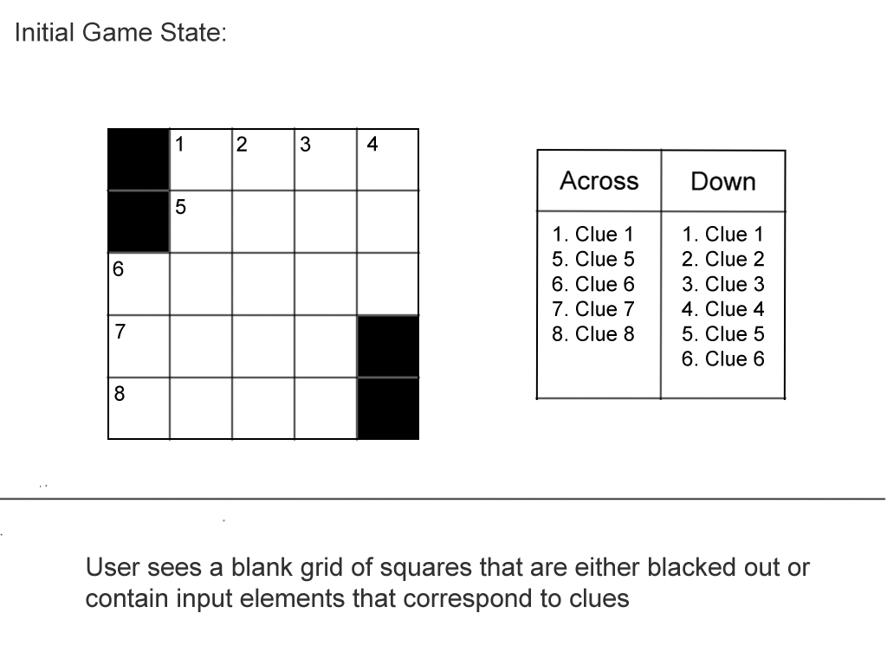
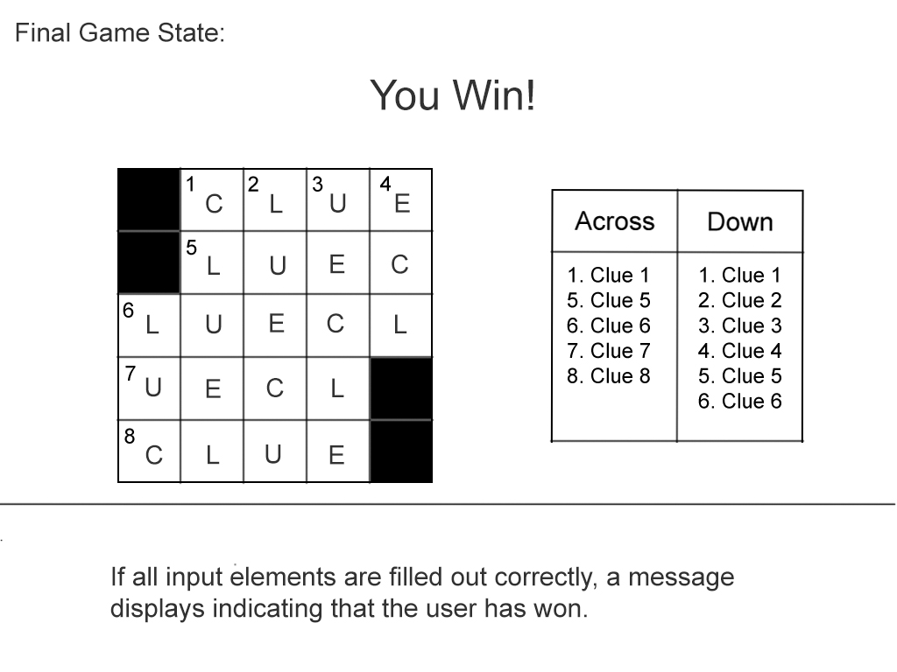

# Crossword Puzzle

## Overview
A crossword is a puzzle consisting of a grid of squares and blanks into which words crossing vertically and horizontally are written according to clues. I chose to build this game because I enjoy the intersection of logic and wordplay, and because I've spent a great deal of time completing crossword puzzles and it would be exciting to break the puzzle down into its smallest parts in order to rebuild it.

## Game Rules
The user completes the puzzle by first reading the provided clues and trying to guess the correct words according to a) the amount of letters in the word and b) intersecting letters that have already been filled out. The user wins by correctly guessing all the vertical and horizontal words.

## Wireframes

## User stories
1) The game starts with a blank 5x5 grid of 25 squares that are either blacked out or able to accept a single letter input. Next to the grid is a list of clues corresponding to the vertical and horizontol words, which are split into seperate lists. The clues are numbered and correspond to numbers on the grid itself to indicate which clue will solve which word.
2) If the user correctly fills out the entire grid, a message will display indicating that the've won. There is not necessarily a way to actively lose the game, but it is certainly possible to not win. 

## MVP checklist
* User input is checked against correct letters.
* If all input matches the pretdetermined correct lettersm a message displays indicating that the user has one.
* User is able to alter previous inputs without reloading the game.

## Stretch goals
### Game flow:
* After input is entered, flow from one box within a word to the next without clicking into it.
* Words are intitally filled out in across/row format but can be toggled to down/column by either clicking a toggle button or double clicking on any box in the word.
* Game will remember orientation from one word to the next.
* When a box is clicked, the entire word it's in will become highlighted with the selected box in a different color.
* When a clue is clicked, its corresponding word inputs arehighlighted, with the box at the beginning of the word in a different color.

### Buttons/Display Elements:
* Automatically store inputs without hitting "enter"
* Show either time elapsed or a countdown for more competitive play
* Option to clear board of user input
* Option to check guesses either automatically or manually
    * Display "/" design across incorrect inputs, turn correct inputs a different color
* Allow user to "pencil-in" inputs by changing input color
* Display selected clue above the puzzle grig by either clicking the clue in the list or by clicking any input element and it will display the corresponding clue
    * Arrow buttons to display previous or subsequent clue and highlight the corresponding word inputs
    * If the user wins, that message will display in place of the selected clue
* Option to change color scheme according to predetermined list of options

### Extra stretch
* Additional puzzles
* Bigger puzzle grids